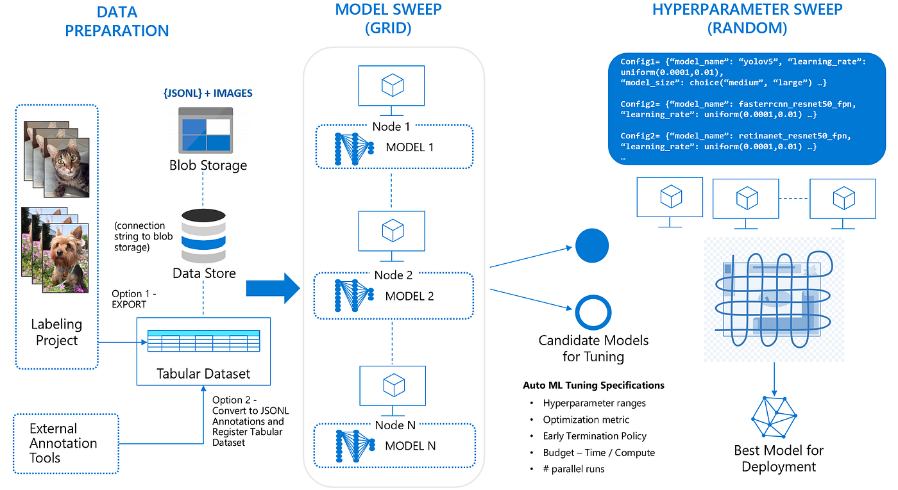
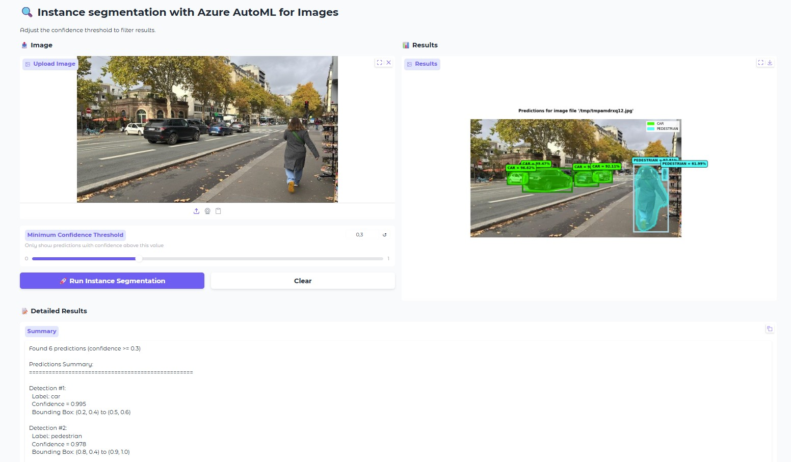

# Instance Segmentation with Azure AutoML for Images

[](https://azure.microsoft.com/services/machine-learning/)
[](https://www.python.org/)
[](LICENSE)


<br>


---

## 🚀 Overview

This repository is a step-by-step, production-grade tutorial for building, training, and deploying **instance segmentation** models using [Azure Machine Learning AutoML for Images](https://learn.microsoft.com/azure/machine-learning/concept-automated-ml#computer-vision-preview). We guide you through the entire process—from dataset preparation to real-time inference via a web application—using Azure’s powerful automation and managed services.

**Instance segmentation** goes beyond object detection by precisely outlining (segmenting) every object in an image at the pixel level.

---

## 🌟 Features

- **One-Click Model Training:** Azure AutoML picks and optimizes the best deep learning architecture automatically.
- **Complete Pipeline:** All steps included: dataset download, exploratory analysis, splitting, training, validation, deployment, and inference.
- **Interactive Web UI:** Gradio-based app for fast, user-friendly model evaluation and visual demos.
- **Supports Top Architectures:** Includes Mask R-CNN and other state-of-the-art models.
- **MLflow Experiment Tracking:** Easily compare runs, models, and metrics.
- **Cloud Deployment Ready:** Deploy instantly as a secure managed endpoint on Azure.

---

## 🗂️ Repository Structure and Notebooks

**1. Data Preparation**  
[`1 Download images files and labels.ipynb`](1%20Download%20images%20files%20and%20labels.ipynb)  
- Download & organize images and annotations (labels)
- Exploratory data analysis (EDA)
- Train/validation/test split automation
- Utilities for annotation conversion and validation

**2. AutoML Model Training**  
[`2 AutoML for Instance segmentation.ipynb`](2%20AutoML%20for%20Instance%20segmentation.ipynb)  
- Azure ML workspace setup and compute configuration
- Build MLTable assets
- Launch AutoML experiments, tune hyperparameters, try multiple models
- Evaluate, log, and register the best model
- Deploy trained model to a managed endpoint

**3. Deployment & Inference**  
[`3 Instance segmentation model inferencing.ipynb`](3%20Instance%20segmentation%20model%20inferencing.ipynb)  
- Query your deployed endpoint using REST API
- Production-ready batch and real-time inference
- Launch the Gradio app for live demos & testing
- Analyze and visualize segmentation outputs

---

## 🏁 Getting Started

### Prerequisites

- Active **Azure Subscription** with [Azure Machine Learning](https://azure.microsoft.com/services/machine-learning/)
- **Azure ML Workspace** set up
- **Python 3.10+**
- Recommended: Access to a GPU compute cluster (e.g., `Standard_NC24ads_A100_v4`)

### Setup

1. **Clone the Repository**  
   ```bash
   git clone https://github.com/retkowsky/instance-segmentation-azure-automl-for-images.git
   cd instance-segmentation-azure-automl-for-images
   ```

2. **Install Dependencies**  
   We recommend using a virtual environment:  
   ```bash
   python -m venv .env
   source .env/bin/activate  # On Windows use `.env\Scripts\activate`
   pip install -r requirements.txt
   ```

3. **Configure Azure**  
   - Create or use an existing Azure ML workspace.
   - Fill in your Azure credentials in the provided `azure.env` file.

4. **Run Notebooks**  
   In order (highly recommended):  
   1. `1 Download images files and labels.ipynb`
   2. `2 AutoML for Instance segmentation.ipynb`
   3. `3 Instance segmentation model inferencing.ipynb`

---

## 📚 Resources

- [Azure ML AutoML for Images](https://learn.microsoft.com/azure/machine-learning/concept-automated-ml#computer-vision-preview)
- [Supported Model Architectures](https://learn.microsoft.com/azure/machine-learning/how-to-auto-train-image-models)
- [Azure MLflow Tracking](https://learn.microsoft.com/azure/machine-learning/how-to-use-mlflow)
- [Azure ML Example Gallery](https://github.com/Azure/azureml-examples)
- [Instance Segmentation Example](https://github.com/Azure/azureml-examples/tree/main/sdk/python/jobs/automl-standalone-jobs/automl-image-instance-segmentation-task-fridge-items)

---

## 💻 Screenshots

*(Add example results, images, or GIFs to show inference and web app in action!)*

---

## ❤️ Contributions

Contributions are welcome! Please open PRs or issues if you improve the notebooks, add datasets, or extend supported architectures.

---

## 📬 Contact

**Serge Retkowsky**  
- Email: serge.retkowsky@microsoft.com  
- [LinkedIn](https://www.linkedin.com/in/serger/)  
- Updated: 14th November 2025

> **Note:**  
> Usage of this project may incur Azure cloud charges for compute, storage, and endpoints. Review the current [Azure ML pricing](https://azure.microsoft.com/pricing/details/machine-learning/).